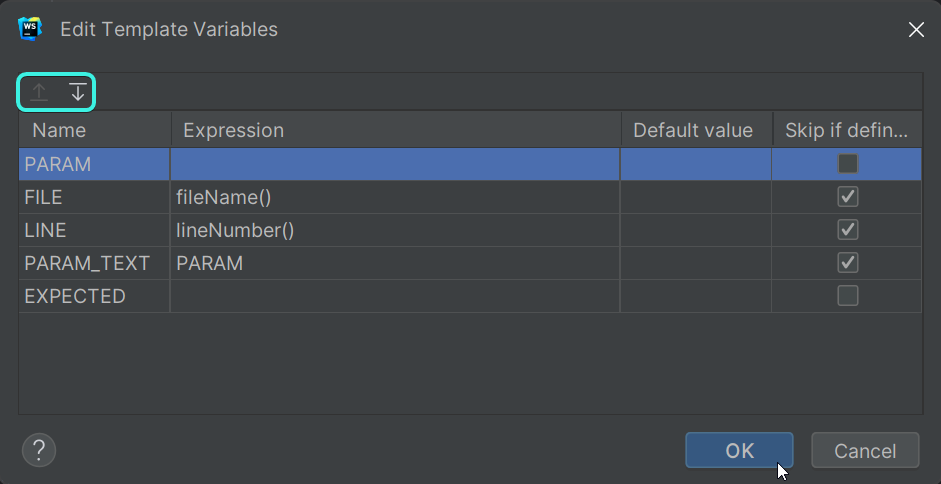
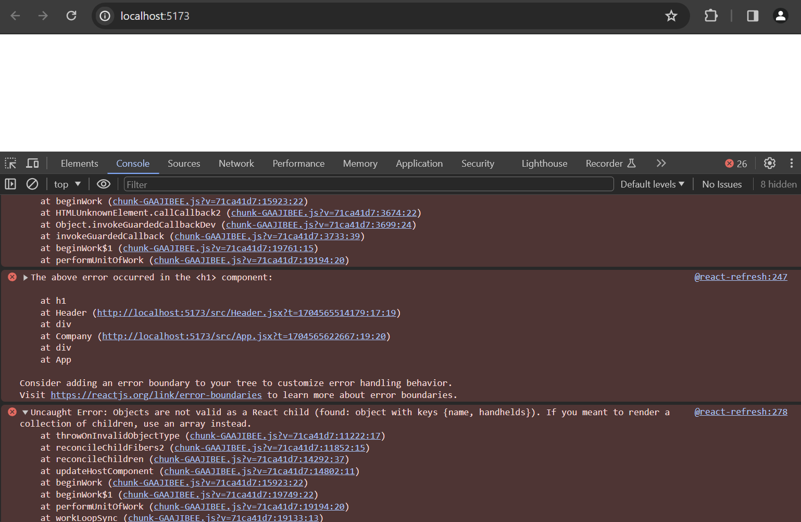
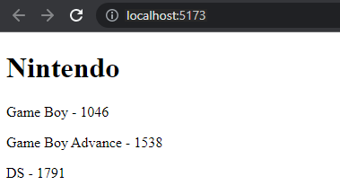
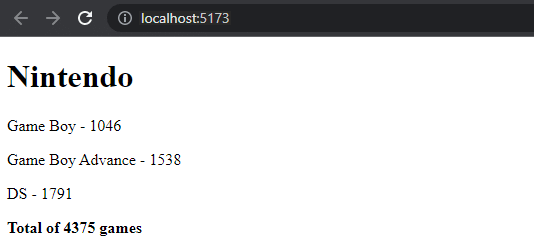

<div class="content">

Before starting a new part, let's recap some of the topics that proved difficult last year.

### Protip: WebStorm Live Templates

With WebStorm it's easy to create and 'live templates', i.e., shortcuts/snippets
for quickly generating commonly re-used portions of code, much like how `sout` works in Netbeans and `psvm` works in IntelliJ.

**Try erasing everything in *App.jsx*, then type `rsc` and then hit the *Tab* key and see the magic that appears!**

Instructions for working with live templates can be found [here](https://blog.jetbrains.com/webstorm/2018/01/using-and-creating-code-snippets/#work_with_live_templates).

There are already lots of live templates that are available for you to review in ***Settings->Editor->Live Templates***.

Another live template for the `console.log()` command, which is, **log**.

To use it, type `log` and hit Tab to autocomplete.

Though it doesn't stop there, as you can make *custom live templates*.

For example, I'm going to take
[this tutorial](https://betterprogramming.pub/intellij-live-template-for-console-log-that-will-improve-your-daily-development-life-ef1320a8fe81)
and boil it down to its essence.

Let's setup a custom `clog` live template.

1. Go to ***Settings->Editor->Live Templates***
2. With Javascript Selected, click on the `+` icon.
3. Type `clog` for the Abbreviation and `More detailed console.log` for the Description
4. Paste this in the template text:

    ```js
    console.log('File: $FILE$, Function: $FUNCTION$, Line $LINE$ - Is $PARAM_TEXT$ ($EXPECTED$)?: ', $PARAM$);$END$
    ```

5. Select ***Reformat according to style***
6. Click the Define linke below the template text and select ***Javascript & Typescript***.
7. Finally click edit variables and make it looks like this, make sure you have the order of the variables as well.



Click ***OK*** twice and then try it out by typing `clog` and then ***Tab***.
You'll notice that you have this template that will provide you with a function name and line number
as well as other neat values to make it easier to debug!

### JavaScript Arrays

From here on out, we will be using the functional programming methods of the JavaScript
[array](https://developer.mozilla.org/en-US/docs/Web/JavaScript/Reference/Global_Objects/Array),
such as `find`, `filter`, and `map` - all of the time.
They operate on the same general principles as their equivalents in other languages and as streams in Java.

If operating arrays with functional operators makes you feel uneasy, it is worth watching at least the first three parts of the YouTube video series
[Functional Programming in JavaScript](https://www.youtube.com/playlist?list=PL0zVEGEvSaeEd9hlmCXrk5yUyqUag-n84):

- [Higher-order functions](https://www.youtube.com/watch?v=BMUiFMZr7vk&list=PL0zVEGEvSaeEd9hlmCXrk5yUyqUag-n84)
- [Map](https://www.youtube.com/watch?v=bCqtb-Z5YGQ&list=PL0zVEGEvSaeEd9hlmCXrk5yUyqUag-n84&index=2)
- [Reduce basics](https://www.youtube.com/watch?v=Wl98eZpkp-c&t=31s)

### Event Handlers Revisited

Event handling is complex.

It's worth reviewing the
[previous section on event handlers](/part1/a_more_complex_state_debugging_react_apps#event-handling-revisited).

Passing event handlers to the child components of the `App` component can also be complex, so you may want to revisit
[the material that was provided about the topic here](/part1/a_more_complex_state_debugging_react_apps#passing-event-handlers-to-child-components).

### Rendering Collections

We will now do the 'frontend', or the browser-side application logic, in React for an application that's similar to the example application from [part 0](/part0)

Let's start with the following in *App.jsx*:

```js
const App = (props) => {
  const { tasks } = props

  return (
    <div>
      <h1>Tasks</h1>
      <ul>
        <li>{tasks[0].content}</li>
        <li>{tasks[1].content}</li>
        <li>{tasks[2].content}</li>
      </ul>
    </div>
  )
}

export default App
```

We'll also need this in *main.jsx*:

```js
import ReactDOM from 'react-dom/client'

import App from './App'

const tasks = [
  {
    id: 1,
    content: 'Wash the dishes',
    date: '2023-01-10T17:30:31.098Z',
    important: true
  },
  {
    id: 2,
    content: 'Take out the trash',
    date: '2023-01-10T18:39:34.091Z',
    important: false
  },
  {
    id: 3,
    content: 'Buy salty snacks',
    date: '2023-01-10T19:20:14.298Z',
    important: true
  }
]

ReactDOM.createRoot(document.getElementById('root')).render(
  <App tasks={tasks} />
)
```

Every task contains its textual content and a timestamp,
as well as a `boolean` value for marking whether the task has been categorized as important or not, and also a unique `id`.

The example above works because there are exactly three tasks in the array.

A single task is rendered by accessing the objects in the array by referring to a hard-coded index number:

```js
<li>{tasks[1].content}</li>
```

This is, of course, not elegant.
We can improve on this by generating React elements from the array objects using the
[`map` function](https://developer.mozilla.org/en-US/docs/Web/JavaScript/Reference/Global_Objects/Array/map).

```js
tasks.map(task => <li>{task.content}</li>)
```

The result is an array of `li` elements.

```js
[
  <li>Wash the dishes</li>,
  <li>Take out the trash</li>,
  <li>Buy salty snacks</li>,
]
```

Which can then be placed inside `ul` tags:

```js
const App = (props) => {
  const { tasks } = props

  return (
    <div>
      <h1>Tasks</h1>
// highlight-start
      <ul>
        {tasks.map(task => <li>{task.content}</li>)}
      </ul>
// highlight-end      
    </div>
  )
}
```

Because the code generating the `li` tags is JavaScript, it must be wrapped in curly braces in a JSX template just like all other JavaScript code.

We will also make the code more readable by separating the arrow function's declaration across multiple lines:

```js
const App = (props) => {
  const { tasks } = props

  return (
    <div>
      <h1>Tasks</h1>
      <ul>
        {tasks.map(task => 
        // highlight-start
          <li>
            {task.content}
          </li>
        // highlight-end   
        )}
      </ul>
    </div>
  )
}
```

### Key-attribute

Even though the application seems to be working, there is a warning in the console:


As the linked [React page](https://react.dev/learn/rendering-lists#keeping-list-items-in-order-with-key) in the error message suggests;
the list items, i.e. the elements generated by the `map` method, must each have a unique key value: an attribute called **key**.
> **FYI:** *You may have also noticed that ESLint had underlined the `li` element in WebStorm as well, mentioning the missing 'key' prop.*

Let's add the keys:

```js
const App = (props) => {
  const { tasks } = props

  return (
    <div>
      <h1>Tasks</h1>
      <ul>
        {tasks.map(task => 
          <li key={task.id}> // highlight-line
            {task.content}
          </li>
        )}
      </ul>
    </div>
  )
}
```

And the error message disappears.

React uses the key attributes of objects in an array to determine how to update the view generated by a component when the component is re-rendered.
More about this is in the [React documentation](https://react.dev/learn/preserving-and-resetting-state#option-2-resetting-state-with-a-key).

### Map

Understanding how the array method
[`map`](https://developer.mozilla.org/en-US/docs/Web/JavaScript/Reference/Global_Objects/Array/map)
works is crucial for the rest of the course.

Let's revisit the `tasks` array that is currently in *main.jsx*:

```js
const tasks = [
  {
    id: 1,
    content: 'Wash the dishes',
    date: '2023-01-10T17:30:31.098Z',
    important: true
  },
  {
    id: 2,
    content: 'Take out the trash',
    date: '2023-01-10T18:39:34.091Z',
    important: false
  },
  {
    id: 3,
    content: 'Buy salty snacks',
    date: '2023-01-10T19:20:14.298Z',
    important: true
  }
]
```

If the following code is added at the end of *main.jsx*:

```js
const result = tasks.map(task => task.id)
console.log(result)
```

`[1, 2, 3]`  will be printed to the console.
 `map` always creates a new array, the elements of which have been created from the elements of the original array by ***mapping***:
 using the function given as a parameter to the `map` method.

The function in our example is:

```js
task => task.id
```

This is an arrow function written in compact form.
The full form would be:

```js
(task) => {
  return task.id
}
```

The function gets a task object as a parameter and ***returns*** the value of its `id` field.

Changing our `map` line to have the parameter:

```js
const result = tasks.map(task => task.content)
```

results in the console printing *`['Wash the dishes', 'Take out the trash', 'Buy salty snacks']`*.

This is already pretty close to the React code we used:

```js
tasks.map(task =>
  <li key={task.id}>
    {task.content}
  </li>
)
```

This code generated a `li` tag containing the contents of the task from each task object.

Because the function parameter passed to this `map` method -

```js
task => <li key={task.id}>{task.content}</li>
```

is used to create view elements, the value of the variable must be rendered inside curly braces.
Try to see what happens if the braces are removed.

The use of curly braces will cause some pain in the beginning, but you will get used to them soon enough.
The visual feedback from React is immediate.

### Anti-pattern: Array Indexes as Keys

We could have made the error message on our console disappear by using the array indexes as keys.
The indexes can be retrieved by passing a second parameter to the callback function of the `map` method:

```js
tasks.map((task, i) => ...)
```

When called like this, `i` is assigned the value of the index of the position in the array where the task resides.

As such, one way to define the row generation without getting errors is:

```js
<ul>
  {tasks.map((task, i) => 
    <li key={i}>
      {task.content}
    </li>
  )}
</ul>
```

This is, however, **not recommended** and can create undesired problems even if it seems to be working just fine.

Read more about this in [this article](https://robinpokorny.medium.com/index-as-a-key-is-an-anti-pattern-e0349aece318).

### Refactoring Modules

Let's tidy the code up a bit.

We are only interested in the field `tasks` from `props`, so let's retrieve that directly using
[**destructuring**](https://developer.mozilla.org/en-US/docs/Web/JavaScript/Reference/Operators/Destructuring_assignment):

```js
const App = ({ tasks }) => { //highlight-line
  return (
    <div>
      <h1>Tasks</h1>
      <ul>
        {tasks.map(task => 
          <li key={task.id}>
            {task.content}
          </li>
        )}
      </ul>
    </div>
  )
}
```

If you have forgotten what destructuring means and how it works, please review the [section on destructuring](/part1/component_state_event_handlers#destructuring).

We'll separate displaying a single task into its own component `Task`:

```js
// highlight-start
const Task = ({ task }) => {
  return (
    <li>{task.content}</li>
  )
}
// highlight-end

const App = ({ tasks }) => {
  return (
    <div>
      <h1>Tasks</h1>
      <ul>
        // highlight-start
        {tasks.map(task => 
          <Task key={task.id} task={task} />
        )}
         // highlight-end
      </ul>
    </div>
  )
}
```

Notice that the `key` attribute must now be defined for the `Task` components, and not in the `li` tags like before.

A whole React application can be written in a single file.
Although that is, of course, not very practical.
Common practice is to declare each component in its own file as an ES6 **module**.

We have been using *modules* the whole time.
These lines from *main.jsx*:

```js
import ReactDOM from 'react-dom/client'

import App from './App'
```

[**`import`**](https://developer.mozilla.org/en-US/docs/Web/JavaScript/Reference/Statements/import) two modules, enabling them to be used in that file.
The module ***`react-dom/client`*** is placed into the variable `ReactDOM`,
and the module that defines the main component of the app is placed into the variable `App`

Let's move our `Task` component into its own module.

In smaller applications, components are usually placed in a directory called *components*, which is in turn placed within the *src* directory.
The convention is to name the file after the component.

Now, we'll create a directory called ***components*** for our application and place a file named ***Task.jsx*** inside.
*Task.jsx* should have the following:

```js
const Task = ({ task }) => {
  return (
    <li>{task.content}</li>
  )
}

export default Task
```

The last line of the module
[***exports***](https://developer.mozilla.org/en-US/docs/Web/JavaScript/Reference/Statements/export)
the declared module, the variable `Task`.

Now the file that is using the component - *App.jsx* - can [import](https://developer.mozilla.org/en-US/docs/Web/JavaScript/Reference/Statements/import) the module:

```js
import Task from './components/Task' // highlight-line

const App = ({ tasks }) => {
  // ...
}
```

The component exported by the module is now available for use in the variable `Task`, just as it was earlier.

Notice that when importing our own components, their location must be given *in relation to the importing file*:

```js
'./components/Task'
```

The period - `.` - in the beginning refers to the current directory,
so the module's location is a file called *Task.jsx* in the *components* sub-directory of the current directory.
The filename extension *.jsx* can be omitted.

Modules have plenty of other uses other than enabling component declarations to be separated into their own files.
We will get back to them later in this course.

The current code of the application can be found on [GitHub](https://github.com/comp227/part2-tasks/tree/part2-1).

Notice that the *main* branch of the repository is largely empty.
The current code is in the branch [part2-1](https://github.com/comp227/part2-tasks/tree/part2-1):


If you clone the project, run the command `npm install` before starting the application with `npm start`.

### When the Application Breaks

Early in your programming career (and even after 25 years of coding like yours truly),
what often happens is that the application just completely breaks down.
This is even moreso the case with dynamically typed languages, such as JavaScript, where the compiler does not check the data type.
Like with function variables or return values.

A "React explosion" can, for example, look like this:



In these situations, your best way out is the `console.log` method.

The piece of code causing the explosion is this:

```js
const Company = ({ company }) => (
  <div>
    <Header company={company} />
  </div>
)

const App = () => {
  const company = {
    // ...
  }

  return (
    <div>
      <Company company={company} />
    </div>
  )
}
```

We'll hone in on the reason for the breakdown by adding `console.log` commands to the code.
Because the first thing to be rendered is the `App` component, it's worth putting a `console.log` in there.
Use your `clog` live template that we created above to get some easy information in, since `clog` wants variables,
type `company` and then ***Enter*** to type what you expect it to have.
Then, press ***Enter*** again.
For me, I did something like this.

```js
const App = () => {
  const company = {
    // ...
  }

  console.log('File: App.js, Function: App, Line 24 - Is company (JS Object)?: ', company); // highlight-line

  return (
    // ..
  )
}
```

To see the printing in the console, we must scroll up over the long red wall of errors.


When one thing is found to be working, it's time to log deeper.
If the component has been declared as a single statement or a function without a return, it makes printing to the console harder.

```js
const Company = ({ company }) => (
  <div>
    <Header company={company} />
  </div>
)
```

The component should be changed to its longer form for us to add the printing:

```js
const Company = ({ company }) => { 
  console.log(company) // highlight-line
  return (
    <div>
      <Header company={company} />
    </div>
  )
}
```

Quite often the root of the problem is that the props are expected to be of a different type,
or called with a different name than they actually are, and destructuring fails as a result.
The problem often begins to solve itself when destructuring is removed and we see what the `props` contain.

```js
const Company = (props) => { // highlight-line
  console.log(props)  // highlight-line
  const { company } = props
  return (
    <div>
      <Header company={company} />
    </div>
  )
}
```

If the problem has still not been resolved, sadly there isn't much to do apart from continuing to bug-hunt by sprinkling more `console.log` statements around your code.

The original author added this chapter to the material after the model answer for the next question exploded completely
(due to props being of the wrong type), and it had to be debuggged using `console.log`.

***As you continue through, please remember the
[pledge](/part1/a_more_complex_state_debugging_react_apps#web-developers-pledge)
you took to help you improve as a web developer***.

</div>

<div class="tasks">

### Exercises 2.1-2.5

The exercises are submitted through GitHub and marking them as done on Canvas.

Please make sure that you commit often, as that will be the way you show your work and progress through the course.

To start, we will move you to a new repo that will house all of the exercises from part 2.

<http://go.djosv.com/227lab2>

The repo is largely empty, so you'll need to make sure you are in the correct location before calling `vite`
(you should be in the base directory of your lab2 repo that you created from above).

Your folders for this repo should be:

```text
(base)
|-arcade
|-communities
|-countries
```

#### 2.1: handheld arcade info step6

Let's finish the code for rendering companies' handheld arcade games and systems from exercises 1.1 - 1.5.
If you need help getting your solution to a good state, please let me know.
I would recommend that you use `vite` from the base directory and then just copy over the *src* folder.

**Notice that if you copy the entire project from one place to another, you would have to delete the *node_modules* directory
and install the dependencies again with the command `npm install` before you can start the application.**
Later on, we may use this method, but realize that *node_modules* is often huge and highly dependent on your system,
so I think it's easier to let npm and vite do those portions.

You only need to copy the **code**!

Generally, it's not recommended that you copy a project's whole contents and/or add the *node_modules* directory to the version control system.

Let's change the `App` component like so:

```js
const App = () => {
  const company = {
    id: 1,
    name: 'Nintendo',
    handhelds: [
      {
        name: 'Game Boy',
        games: 1046,
        id: 1
      },
      {
        name: 'Game Boy Advance',
        games: 1538,
        id: 2
      },
      {
        name: 'DS',
        games: 1791,
        id: 3
      }
    ]
  }

  return <Company company={company} />
}

export default App
```

Define a component responsible for formatting a single company called `Company`.

The component structure of the application can be, for example, the following:

```shell
App
  Company
    Header
    Content
      Handheld
      Handheld
      ...
```

Hence, the `Company` component contains the components defined in the previous part, which are responsible for rendering the company name and its handhelds.

The rendered page can, for example, look as follows:



You don't need the sum of the games yet.

The application must work *regardless of the number of handhelds a company has*,
so make sure the application works if you add or remove handheld systems that a company has.

Ensure that the console shows no errors!

#### 2.2: handheld arcade info step7

Show also the sum of the games published for all handhelds of a company.



#### 2.3*: handheld arcade info step8

If you haven't done so already, calculate the sum of games with the array method
[reduce](https://developer.mozilla.org/en-US/docs/Web/JavaScript/Reference/Global_Objects/Array/Reduce).

**Pro tip:** when your code looks as follows:

```js
const total = 
  handhelds.reduce((s, p) => someMagicHere)
```
  
and does not work, it's worth it to use `console.log`, which requires the arrow function to be written in its longer form:

```js
const total = handhelds.reduce((s, p) => {
  console.log('what is going on inside handhelds reduce? ', s, p)
  return someMagicHere 
})
```

**Not working?** Use your search engine to look up how `reduce` is used in an **Object Array**.

**Pro tip 2:** If you right click and show context actions (or use the keyboard shortcut, for me it ***Ctrl-1***),
you should see the ability for the IDE to make a variety of changes.
For example, JetBrains will automatically change the short-form arrow functions into their longer form and vice versa,
showing you a preview of what that would look like.


#### 2.4: handheld arcade info step9

Let's extend our application to allow for an ***arbitrary number*** of companies:

```js
const App = () => {
  const companies = [
    {
      name: 'Nintendo',
      id: 1,
      handhelds: [
        {
          name: 'Game Boy',
          games: 1046,
          id: 1
        },
        {
          name: 'Game Boy Advance',
          games: 1538,
          id: 2
        },
        {
          name: 'DS',
          games: 1791,
          id: 3
        },
        {
          name: '3DS',
          games: 1402,
          id: 4
        }
      ]
    }, 
    {
      name: 'Sony',
      id: 2,
      handhelds: [
        {
          name: 'PSP',
          games: 1925,
          id: 1
        },
        {
          name: 'PS Vita',
          games: 1500,
          id: 2
        }
      ]
    }
  ]

  return (
    <div>
      // ...
    </div>
  )
}
```

The application can, for example, look like this:


#### 2.5: separate module

Declare the `Company` component as a separate module that represents a single Company, which is imported by the `App` component.
You can include all subcomponents of the company in the same module.

</div>
